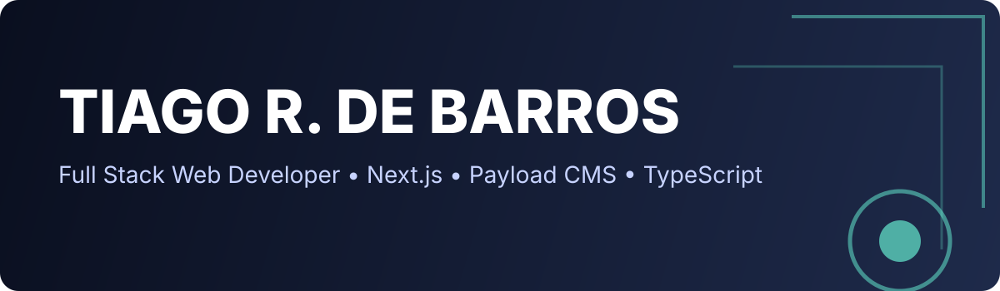

<!-- =======================================================
   GITHUB PROFILE README — TIAGO RIBEIRO DE BARROS
   FULL TECH - TRILÍNGUE (PT/EN/IT)
   ======================================================= -->

<!-- TOP BANNER -->

  

<!-- AVATAR -->

  

<h1 align="center">👋 Olá! / Hello! / Ciao! I'm <strong>Tiago Ribeiro de Barros</strong></h1>

  <b>Full Stack Developer | Payload CMS Expert | Next.js & TypeScript | API Integrator | Cloud & DevOps Learner</b>

  
  
  

---

## 📌 🇧🇷 Sobre mim

Olá! Sou um desenvolvedor Full Stack com foco em aplicações modernas utilizando **Next.js, PayloadCMS, TypeScript, MongoDB, Stripe, Resend e integrações com APIs em tempo real**, incluindo **Web Push, WhatsApp Cloud API, Notifições Web/Mobile** e automações com Node.

Sou apaixonado por:
✅ Desenvolvimento de sistemas completos (frontend + backend + devops)
✅ Construção de ferramentas SaaS
✅ Performance, acessibilidade e UX
✅ Ferramentas sem vendor-lock
✅ Projetos limpos, escaláveis e documentados

Atualmente trabalho em:
- 🩺 Um sistema de gestão e agendamento para clínicas de fisioterapia
- 🧾 Um CRM/ERP com notificações multicanal
- 🔔 Integrações avançadas com NotificationAPI
- 🔄 Migração de WordPress para PayloadCMS + Next.js

---

## 📌 🇺🇸 About me

I'm a Full Stack Developer focused on building modern, scalable, high-performance web applications using **Next.js, Payload CMS, TypeScript, MongoDB, and cloud-based APIs like Stripe, Resend, WhatsApp Cloud API, and Notification systems**.

What I love building:
✔ Full SaaS platforms
✔ Real-time dashboards
✔ Developer-friendly systems
✔ Products that feel fast & “invisible” to the user

Currently working on:
- A full medical appointments platform
- A multi-channel notification CRM
- Automation tools for business workflows
- Migration of legacy WordPress apps into headless stacks

---

## 📌 🇮🇹 Su di me

Sono uno sviluppatore Full Stack specializzato nella creazione di applicazioni web moderne con **Next.js, PayloadCMS, TypeScript e servizi cloud come Stripe, Resend e API WhatsApp**.

Mi appassiono a:
✅ Sistemi scalabili
✅ Applicazioni con performance elevate
✅ UX ben progettata
✅ Automazione & API real-time

Sto attualmente lavorando su:
- Software per cliniche di fisioterapia
- CRM/ERP con notifiche multi-canale
- Integrazioni cloud e API sicure
- Migrazione di vecchi sistemi WordPress

---

## 🧠 Tech Stack

### 🖥️ Frontend

  

### ⚙️ Backend & Dev

  

### 🗄️ Databases

  

### 🧰 Tools, SaaS & APIs

  
  
  
  

---

## 🏆 GitHub Stats (Custom Theme)

  
  

  

---

## 🐍 Contribution Snake

  

---

## 🚀 Projetos em destaque

| Projeto | Descrição | Stack | Repo |
|---------|-----------|-------|------|
| 🩺 **Clinic Scheduler** | Sistema de agendamento para clínicas de fisioterapia com pagamentos, notificações e painel multiusuário | Next.js + PayloadCMS + Stripe + MongoDB | 🔗 soon |
| 🔔 **Notification CRM** | Plataforma de envio e rastreio de notificações multicanal | Next.js + Payload + NotificationAPI | 🔗 soon |
| 🧠 **Code Review Portfolio** | Portfolio interativo com reviews de código | Static + GitHub Pages | [🔗 ver online](https://tiagordebarros.github.io/code-review-portfolio-web/) |

---

## 📡 Onde me encontrar

  
  
  
  
  

---

## 🧩 Fun Facts

- 💬 Eu falo **Português, Inglês e Italiano**
- 🛠️ Já migrei sistemas inteiros de WordPress para Payload/Next.js
- 🧪 Eu adoro testar integrações de APIs que ninguém usa ainda
- 🎧 Sempre programo ouvindo trilhas sonoras épicas
- 🐧 Uso mais terminal que mouse

---

## 📌 Footer

Feito com ❤️ e Markdown · Última atualização automática: <!-- date -->
 
<small>© 2025 · Tiago Ribeiro de Barros</small>

