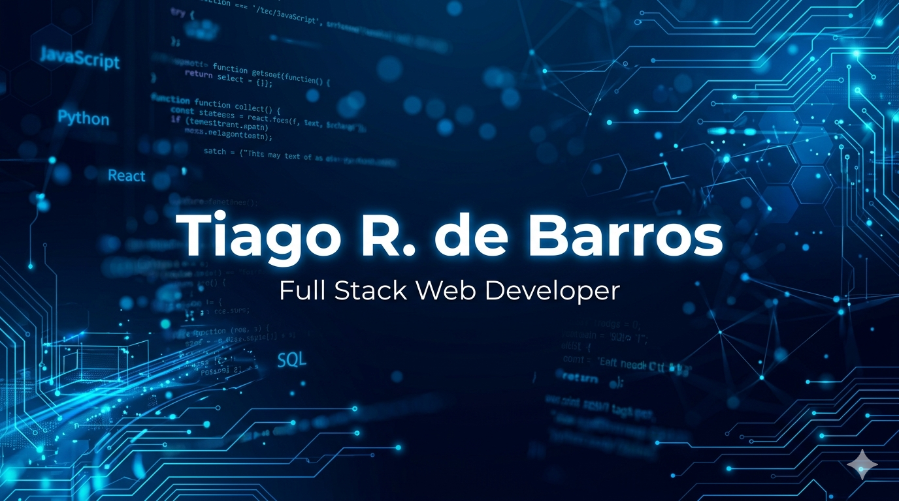
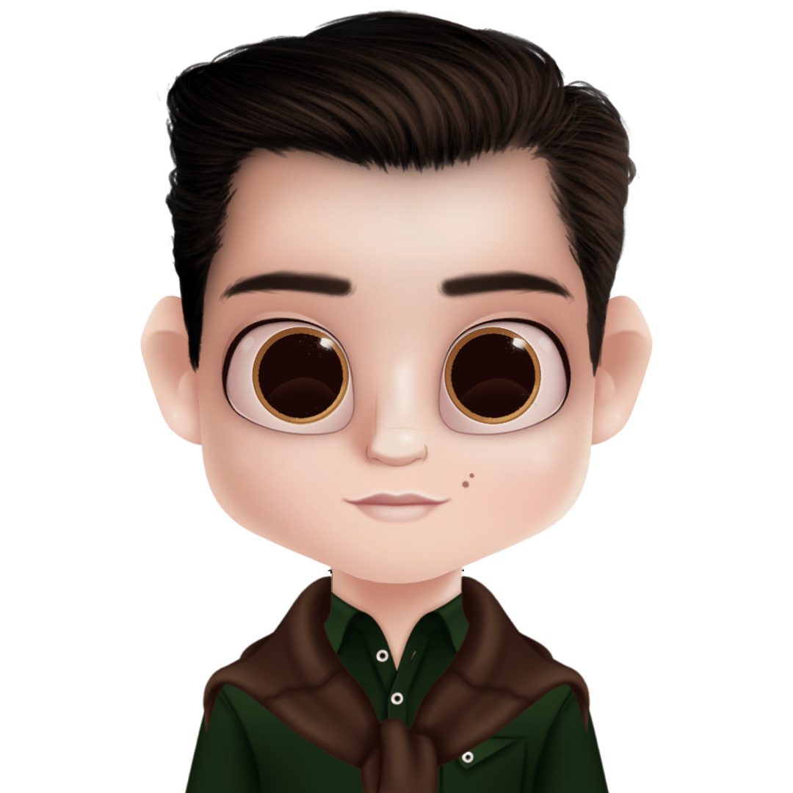
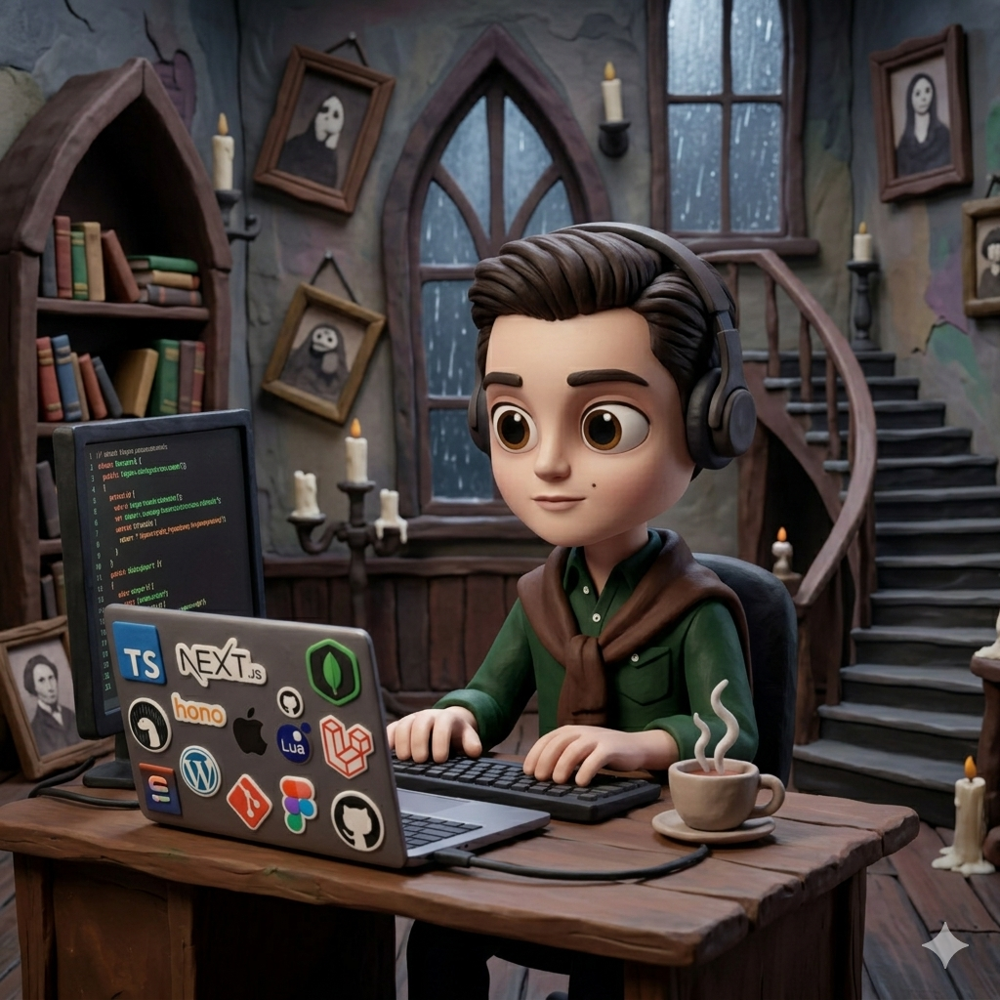

<!-- =======================================================
   GITHUB PROFILE README — TIAGO RIBEIRO DE BARROS -
   FULL STACK WEB DEVELOPER - TRILÍNGUE (PT/EN/IT)
   ======================================================= -->

<!-- TOP BANNER -->
<p align="center">
  
</p>

<!-- AVATAR -->
<p align="center">
  
</p>

<!-- NAVIGATION BAR -->
<p align="center"> <a href="#sobre"><kbd>👤&nbsp;&nbsp;Sobre Mim</kbd></a> &nbsp;&nbsp; <a href="#stack"><kbd>🛠&nbsp;&nbsp;Tech Stack</kbd></a> &nbsp;&nbsp; <a href="#stats"><kbd>📊&nbsp;&nbsp;GitHub Stats</kbd></a> &nbsp;&nbsp; <a href="#projetos"><kbd>🚀&nbsp;&nbsp;Projetos</kbd></a> &nbsp;&nbsp; <a href="#fun"><kbd>🐍&nbsp;&nbsp;Fun Zone</kbd></a> &nbsp;&nbsp; <a href="#contato"><kbd>📡&nbsp;&nbsp;Contato</kbd></a> </p>

<!-- GENERAL STATS -->
<p align="center">
  
  
  
</p>

<!-- ABOUT ME · TRILINGUAL -->

<h2 id="sobre">👤 Sobre Mim &nbsp;/&nbsp; About Me &nbsp;/&nbsp; Su di me</h2>

<details open>
<summary><b>🇧🇷 Português (pt-BR)</b></summary>

Muito prazer, eu sou o Tiago. 😁 Seja muito bem-vindo!

Abaixo, descrevo de maneira bem objetiva algumas coisas sobre mim:

👨🏻‍💻 Eu sou _**Full Stack Web Developer**_. Presto serviços a terceiros através da minha empresa, a **Parceiros de Negócio**.

🏢 A maior parte dos projetos que desenvolvo são portais _web_, CRMs e aplicações SaaS para igrejas católicas, prefeituras, institutos culturais, clínicas e profissionais liberais.

🧰 A _**stack**_ que mais utilizo é composta sobretudo de _Next.js_, _Payload_, _Laravel_, _MongoDB_ e _PostgreSQL_.

💻 A minha linguagem de programação favorita é o _**TypeScript**_. Também tenho orgulho de o Brasil ter desenvolvido a linguagem **Lua**.

🌎 Eu sou brasileiro nato e resido atualmente no Rio Grande do Sul (minha terra natal), mas já morei em Santa Catarina e estudei em Minas Gerais.

✈️ Até bem pouco tempo, eu morava e estudava na Suíça. Também fiz um curso na Itália e já estive em pelo menos 10 países.

🗣️ Estive sempre muito envolvido tanto com a área de humanas quanto de exatas, o que me permitiu desenvolver uma grande habilidade de comunicação, sem deixar de lado a tecnologia.

🥰 Eu sou apaixonado por **EDUCAÇÃO**, **TECNOLOGIA** e **CULTURA**.

📚 O meu principal _hobby_ é a leitura. Também gosto de colecionar moedas e cédulas antigas.

❤️ Sempre atuei em causas voluntárias.

💭 Sonhava em ser desenvolvedor de _software_ desde a minha pré-adolescência, mas só muitos anos depois tive a oportunidade de aprender programação, devido ao alto custo dos cursos na minha época.

🎯 O meu objetivo é me desenvolver cada dia mais na criação de _software_ e o meu sonho é ensinar programação ao maior número possível de pessoas.

</details>

<details>
<summary><b>🇺🇸 English (en-US)</b></summary>

Nice to meet you, I'm Tiago. 😁 Welcome!

Below, I briefly describe a few things about myself:

👨🏻‍💻 I am a _**Full Stack Web Developer**_. I provide services to clients through my company, **Parceiros de Negócio**.

🏢 Most of the projects I develop are web portals, CRMs, and SaaS applications for Catholic parishes, city halls, cultural institutes, medical clinics, and independent professionals.

🧰 My go-to _**stack**_ consists primarily of _Next.js_, _Payload_, _Laravel_, _MongoDB_, and _PostgreSQL_.

💻 My favorite programming language is _**TypeScript**_. I am also proud that Brazil created the **Lua** programming language.

🌎 I am a native Brazilian currently living in Rio Grande do Sul (my home state), but I have also lived in Santa Catarina and studied in Minas Gerais.

✈️ Until very recently, I lived and studied in Switzerland. I also took a course in Italy, and I have visited at least 10 countries.

🗣️ I have always been deeply involved in both the humanities and exact sciences, which has allowed me to develop strong communication skills without leaving technology aside.

🥰 I am passionate about **EDUCATION**, **TECHNOLOGY**, and **CULTURE**.

📚 My main _hobby_ is reading. I also enjoy collecting old coins and banknotes.

❤️ I have always been involved in volunteer work.

💭 I dreamed of becoming a software developer since my early teens, but I only had the opportunity to learn programming many years later due to the high cost of courses at the time.

🎯 My goal is to continuously grow in software development, and my dream is to teach programming to as many people as possible.

</details>

<details>
<summary><b>🇨🇭 Italiano (it-CH)</b></summary>

Piacere di conoscerti, sono Tiago. 😁 Benvenuto!

Di seguito descrivo brevemente alcune cose su di me:

👨🏻‍💻 Sono un _**Full Stack Web Developer**_. Offro servizi a terzi tramite la mia azienda, **Parceiros de Negócio**.

🏢 La maggior parte dei progetti che sviluppo sono portali web, CRM e applicazioni SaaS per parrocchie cattoliche, municipi, istituti culturali, cliniche mediche e liberi professionisti.

🧰 La mia _**stack**_ principale è composta soprattutto da _Next.js_, _Payload_, _Laravel_, _MongoDB_ e _PostgreSQL_.

💻 Il mio linguaggio di programmazione preferito è il _**TypeScript**_. Sono anche orgoglioso che il Brasile abbia sviluppato il linguaggio **Lua**.

🌎 Sono brasiliano di nascita e attualmente vivo nel Rio Grande do Sul (il mio stato natale), ma ho vissuto a Santa Catarina e ho studiato nel Minas Gerais.

✈️ Fino a poco tempo fa, vivevo e studiavo in Svizzera. Ho anche seguito un corso in Italia e ho visitato almeno 10 paesi.

🗣️ Sono sempre stato molto coinvolto sia nelle materie umanistiche che in quelle scientifiche, il che mi ha permesso di sviluppare ottime capacità comunicative senza tralasciare la tecnologia.

🥰 Sono appassionato di **EDUCAZIONE**, **TECNOLOGIA** e **CULTURA**.

📚 Il mio _hobby_ principale è la lettura. Mi piace anche collezionare monete e banconote antiche.

❤️ Sono sempre stato attivo nel volontariato.

💭 Sognavo di diventare uno sviluppatore di _software_ fin dalla prima adolescenza, ma ho avuto l'opportunità di imparare a programmare solo molti anni dopo a causa dell'elevato costo dei corsi in quel periodo.

🎯 Il mio obiettivo è crescere ogni giorno di più nello sviluppo di _software_, e il mio sogno è insegnare la programmazione al maggior numero possibile di persone.

</details>

<!-- Banner Tiago Dev -->
<p align="center">
  
</p>

<!--TECH STACK -->
<h2 id="stack">🛠 Tech Stack</h2>

<details open>
<summary><strong>🖥️ Frontend</strong></summary>
<br/>
<p align="left">


</p>
</details>

<details open>
<summary><strong>⚙️ Backend</strong></summary>
<br/>
<p align="left">


</p>
</details>

<details open>
<summary><strong>🗄️ Database</strong></summary>
<br/>
<p align="left">


</p>
</details>

<details open>
<summary><strong>☁️ DevOps, Cloud & SO</strong></summary>
<br/>
<p align="left">


</p>
</details>

<details open>
<summary><strong>🛠️ Ferramentas & Testes</strong></summary>
<br/>
<p align="left">


</p>
</details>

<details open>
<summary><strong>🎨 Design & Produtividade</strong></summary>
<br/>
<p align="left">


</p>
</details>

<!-- GITHUB STATS -->
<h2 id="stats">📊 GitHub Stats</h2>
<div data-importer="stats" align="center">
  
  
  
  
  
</div>

<!-- FUN ZONE  -->
<h2 id="fun">🐍 Fun Zone</h2>

<h3>🐍 Snake</h3>
<div align="center"> <picture> <source media="(prefers-color-scheme: dark)" srcset="https://raw.githubusercontent.com/tiagordebarros/tiagordebarros/output/snake-dark.svg"/> <source media="(prefers-color-scheme: light)" srcset="https://raw.githubusercontent.com/tiagordebarros/tiagordebarros/output/snake.svg"/>  </picture> </div>

<h3>👾 Pac-Man</h3>
<div align="center"> <picture> <source media="(prefers-color-scheme: dark)" srcset="https://raw.githubusercontent.com/tiagordebarros/tiagordebarros/output/pacman-contribution-graph-dark.svg"/> <source media="(prefers-color-scheme: light)" srcset="https://raw.githubusercontent.com/tiagordebarros/tiagordebarros/output/pacman-contribution-graph.svg"/>  </picture> </div>

<h3>🔢 Contador</h3>
<div align="center">  </div>

<!-- FUN FACTS -->
<h2>🧩 Fun Facts</h2>

```typescript
const tiagordebarros = {
  languages: ["🇧🇷 Português", "🇺🇸 English", "🇮🇹 Italiano"],
  mainStack: ["Next.js", "Payload", "TypeScript", "MongoDB"],
  currentOS: "MacOS 🍎 & Linux 🐧 (mais terminal do que mouse)",
  editor: "Zed (com o tema Catppuccin)",
  music: "Lo-fi enquanto codo 🎧",
  superpower:
    "Trabalhar em apps open source, como o Vero, enquanto outros estão descansando",
  funFact:
    "Adoro testar integrações de APIs e novas ferramentas que quase ninguém usa ainda 🧪",
  motto: "Virtus in medium est 🚀",
};
```

<!--  ONDE ME ENCONTRAR -->
<h2 id="contato">📡 Onde me encontrar</h2>
<details open>
<summary><strong>📫 Contato & Redes</strong></summary>
<br/>
<p align="left">
<a href="https://www.linkedin.com/in/tiagoribeirodebarros/" target="_blank"></a>
<a href="mailto:tiagordebarros@gmail.com" target="_blank"></a>
<!--<a href="SEU_LINK_AQUI" target="_blank"></a>-->
<a href="https://www.instagram.com/tiagordebarros/" target="_blank"></a>
<a href="https://dev.to/tiagordebarros/" target="_blank"></a>
</p>
</details>

<!-- FOOTER -->
<p align="center">  </p>
<p align="center"> Feito com ❤️, ☕ e muito <code>git push --force</code> · Auto-updated. <br/> <small>© 2021-2026 · Tiago Ribeiro de Barros · <a href="#sobre">↑ Voltar ao topo</a></small> </p>
